<!-- ═══════════════════════════════════════════════════════════════════════ -->
<!--                          HEADER / HERO BANNER                            -->
<!--  Self-hosted SVG (assets/header.svg) — generated by the stats workflow,  -->
<!--  so it never depends on a rate-limited third-party image service.        -->
<!-- ═══════════════════════════════════════════════════════════════════════ -->

<a href="https://harikeshav.me">
  
</a>

<!-- ── Typing subtitle ─────────────────────────────────────────────────── -->
<div align="center">

[](https://harikeshav.me)

</div>

<!-- ── Social / contact badges ─────────────────────────────────────────── -->
<div align="center">

[](https://harikeshav.me)
[](https://linkedin.com/in/harikeshav-rameshkumar)
[](mailto:r.harikeshav@icloud.com)
[](https://github.com/Harikeshav-R)

</div>

<br/>

<!-- ═══════════════════════════════════════════════════════════════════════ -->
<!--                              ABOUT ME                                    -->
<!-- ═══════════════════════════════════════════════════════════════════════ -->

##  &nbsp; whoami

```python
class Harikeshav:
    def __init__(self):
        self.role       = "Systems & AI Engineer"
        self.education  = "B.S. Computer Science @ Ohio State (Accelerated 3-Year Track)"
        self.grad       = "May 2027 · Dean's List & University Honors (all semesters)"
        self.focus      = ["High-Performance Computing", "Distributed Systems",
                           "LLM Architecture", "Applied Cryptography"]
        self.currently  = "SWE Intern @ GE Aerospace — AI / FinFlow Team"

    def philosophy(self) -> str:
        return "Go a layer deeper — from SIMD kernels to multi-agent orchestration."
```

- 🧪 &nbsp;Researching **encrypted computation** — compiling neural nets to run directly on ciphertext with Fully Homomorphic Encryption.
- 🏆 &nbsp;**7×** hackathon-winning teams (RevolutionUC, TartanHacks @ CMU, NextHacks, HackOHI/O).
- 📫 &nbsp;Reach me at **r.harikeshav@icloud.com** &nbsp;·&nbsp; more at **[harikeshav.me](https://harikeshav.me)**

<br/>

<!-- ═══════════════════════════════════════════════════════════════════════ -->
<!--                              TECH STACK                                  -->
<!--  shields.io badges are static renderers — they never rate-limit.         -->
<!-- ═══════════════════════════════════════════════════════════════════════ -->

## 🛠️ &nbsp; Tech Arsenal

<div align="center">

**Languages**


**AI / ML & LLMs**


**Backend & Web**


**Cloud, DevOps & Data**


**Systems & Security**


-0071C5?style=for-the-badge&logo=intel&logoColor=white)
-4B275F?style=for-the-badge&logo=letsencrypt&logoColor=white)

</div>

<br/>

<!-- ═══════════════════════════════════════════════════════════════════════ -->
<!--                              GITHUB STATS                                -->
<!--  Self-hosted SVGs regenerated twice daily by .github/workflows/stats.yml -->
<!--  (github-readme-stats / streak-stats are rate-limited & get proxy-blocked)-->
<!-- ═══════════════════════════════════════════════════════════════════════ -->

## 📊 &nbsp; GitHub Analytics

<div align="center">




<br/>



<br/>


</div>

<br/>

<!-- ═══════════════════════════════════════════════════════════════════════ -->
<!--                               EXPERIENCE                                 -->
<!-- ═══════════════════════════════════════════════════════════════════════ -->

## 💼 &nbsp; Experience Highlights

| When | Where | What |
|:----:|:------|:-----|
| **2026** | **GE Aerospace** — AI / FinFlow | Built a Bedrock + Claude extraction pipeline cutting per-doc latency **74%**; drove `mypy --strict` errors **93 → 0** and grew the test suite to **78 tests**. |
| **2025** | **Siage Solutions** | Shipped a **RAG** knowledge assistant over 100+ manuals (15M+ tokens), cutting search latency **91%**; served vLLM inference to **2,500+** daily users. |
| **2023** | **IIT Madras** — Wireless & Spatial AI | Modeled indoor Wi-Fi signal strength to **R² = 0.975**, cutting manual site-survey effort **86%**. |

<br/>

<!-- ═══════════════════════════════════════════════════════════════════════ -->
<!--                                AWARDS                                    -->
<!-- ═══════════════════════════════════════════════════════════════════════ -->

## 🏆 &nbsp; Awards

- 🥈 &nbsp;**2nd Place · Medpace Track · RevolutionUC 2026** (60+ teams) — *Pulse*, a multi-agent clinical-trial safety platform
- 🥉 &nbsp;**3rd Place · Visa Track · TartanHacks 2026** (CMU, 1,200+ hackers) — *Penny*, an AI personal-finance assistant
- 🥉 &nbsp;**3rd Place · The Token Company Track · NextHacks 2026** (2,000+ participants) — *Distill*, an LLM context-compression engine
- 🎖️ &nbsp;**Best AI Hack Runner-Up · HackOHI/O 2025** (800+ participants) — *LeadForge*, an autonomous agentic sales platform

<br/>

<!-- ═══════════════════════════════════════════════════════════════════════ -->
<!--                          CONTRIBUTION SNAKE                              -->
<!-- ═══════════════════════════════════════════════════════════════════════ -->

## 🐍 &nbsp; Contribution Graph

<div align="center">

<picture>
  <source media="(prefers-color-scheme: dark)" srcset="https://raw.githubusercontent.com/Harikeshav-R/Harikeshav-R/output/github-contribution-grid-snake-dark.svg" />
  <source media="(prefers-color-scheme: light)" srcset="https://raw.githubusercontent.com/Harikeshav-R/Harikeshav-R/output/github-contribution-grid-snake.svg" />
  
</picture>

</div>

<br/>

<!-- ═══════════════════════════════════════════════════════════════════════ -->
<!--                                FOOTER                                    -->
<!-- ═══════════════════════════════════════════════════════════════════════ -->

<div align="center">

### 💬 &nbsp; Let's build something that goes a layer deeper.

<a href="https://harikeshav.me"></a>
<a href="https://linkedin.com/in/harikeshav-rameshkumar"></a>
<a href="mailto:r.harikeshav@icloud.com"></a>

</div>
